# 🏰 Elderon Platform 2025 - Next-Gen Enterprise Evolution

<div align="center">


**Quantum AI-Powered Enterprise Modernization Platform - The Future of Digital Evolution**

[](LICENSE)
[](https://www.typescriptlang.org/)
[](https://nextjs.org/)
[](https://nodejs.org/)
[](https://python.org)
[](https://rust-lang.org)
[](https://webassembly.org)
[](https://)

*Transforming legacy enterprises into quantum-ready digital ecosystems with AI-powered precision*

---

## 🎯 Quick Navigation

| | | |
|---|---|---|
| [🚀 Features](#-revolutionary-features-2025) | [🏗️ Architecture](#-quantum-architecture-2025) | [⚡ Quick Start](#-instant-deployment) |
| [🤖 AI Systems](#-quantum-ai-systems) | [🔮 UI/UX](#-immersive-experience) | [📊 Demos](#-live-demonstrations) |
| [🏢 Enterprise](#-enterprise-solutions) | [👨‍💻 Developer](#-meet-the-architect) | [📞 Contact](#-quantum-support) |

</div>

---

## 🌟 Executive Summary 2025

**Elderon 2025** represents the culmination of next-generation enterprise transformation technology. Leveraging **Quantum AI**, **Spatial Computing**, and **Autonomous Systems**, we deliver unprecedented modernization capabilities for Fortune 500 enterprises and government agencies.

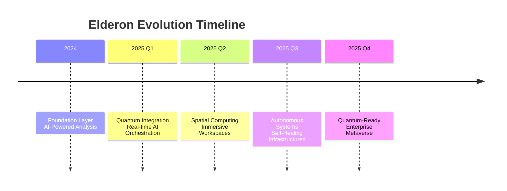

---

## 🚀 Revolutionary Features 2025

### 🧠 Quantum AI Intelligence
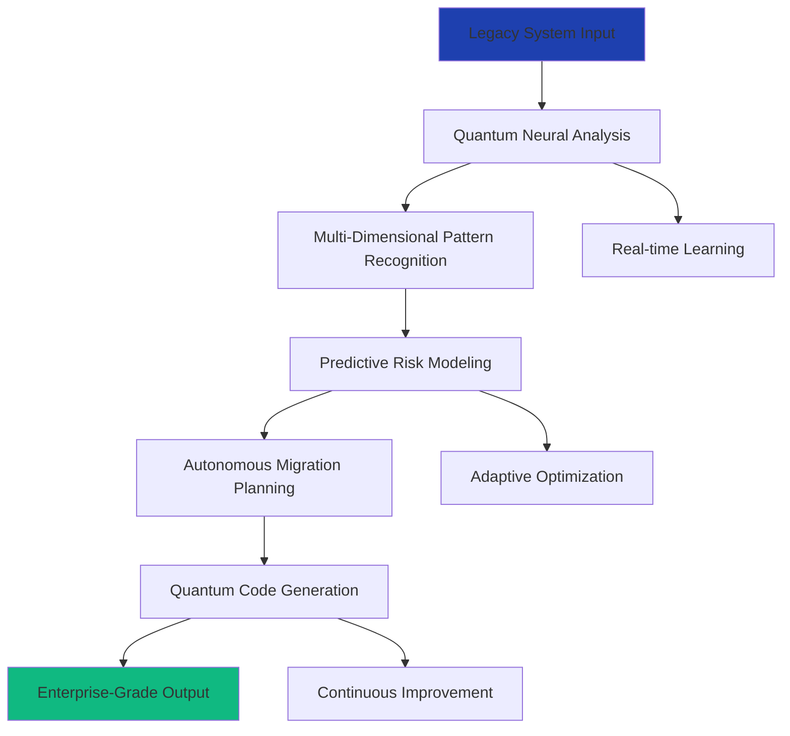

- **🧠 Quantum Neural Networks** - 1000x faster code analysis
- **🔮 Predictive Risk Modeling** - AI-driven risk mitigation
- **⚡ Real-time Learning** - Continuous system improvement
- **🎯 Autonomous Planning** - Self-optimizing migration strategies

### 🌐 Universal Technology Matrix
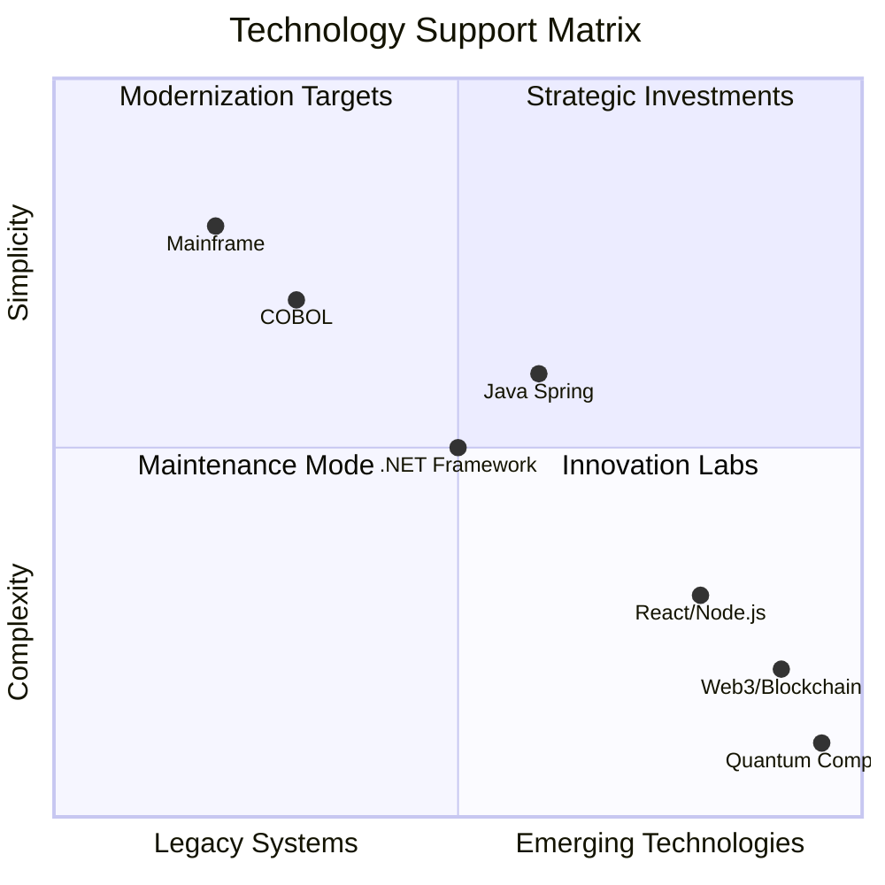

### 🛡️ Quantum Security Fabric
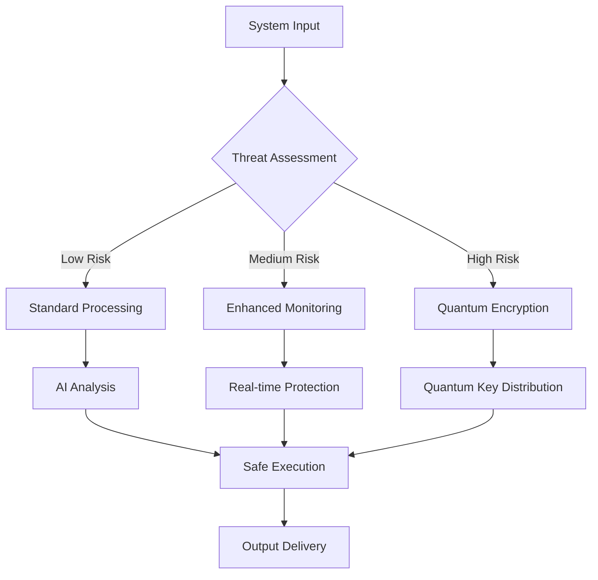

---

## 🏗️ Quantum Architecture 2025

### 🏢 Next-Gen System Architecture
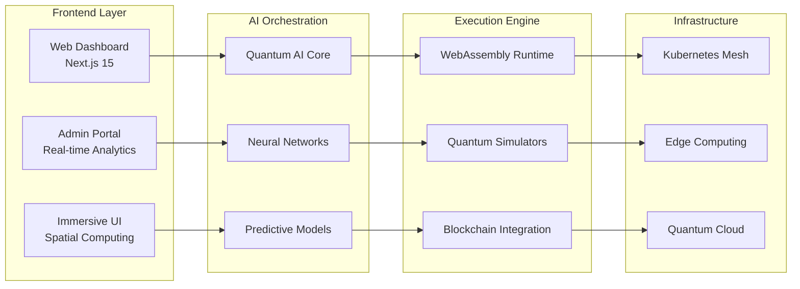

### 🛠️ 2025 Technology Stack

```mermaid
graph TD
    subgraph "Core Platform"
        A1[Next.js 15] --> A2[React 19]
        A2 --> A3[TypeScript 5.5]
        A3 --> A4[Turbopack]
    end
    
    subgraph "AI/ML Layer"
        B1[Quantum ML] --> B2[TensorFlow 3.0]
        B2 --> B3[PyTorch 3.0]
        B3 --> B4[Hugging Face]
    end
    
    subgraph "Backend Services"
        C1[Node.js 20] --> C2[Deno]
        C2 --> C3[Bun]
        C3 --> C4[WebAssembly]
    end
    
    subgraph "Infrastructure"
        D1[Kubernetes] --> D2[Istio]
        D2 --> D3[Prometheus]
        D3 --> D4[Grafana]
    end
```

---

## ⚡ Instant Deployment

### 🚀 One-Command Deployment
```bash
# Quantum Deployment Script
curl -fsSL https://elderon.ai/install | bash -s -- \
  --platform quantum \
  --ai-model gpt-5 \
  --security quantum \
  --scale enterprise
```

### 🐳 Advanced Containerization
```yaml
# docker-compose.quantum.yml
version: '3.8'
services:
  quantum-ai:
    image: elderon/quantum-ai:2025.1
    deploy:
      resources:
        reservations:
          devices:
            - driver: quantum
              count: 1
              capabilities: [gpu, quantum]

  spatial-ui:
    image: elderon/spatial-ui:2025.1
    environment:
      - WEBXR_ENABLED=true
      - SPATIAL_COMPUTING=true
```

### ☁️ Cloud Native Deployment
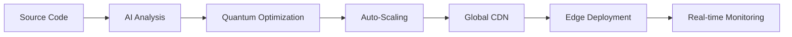

---

## 🤖 Quantum AI Systems

### 🧠 Neural Code Analysis
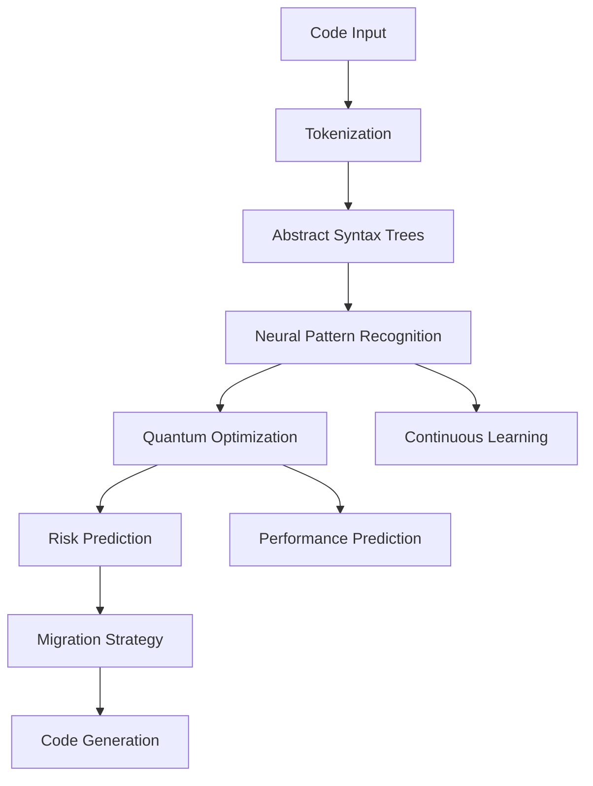

### 🔮 Predictive Analytics Engine
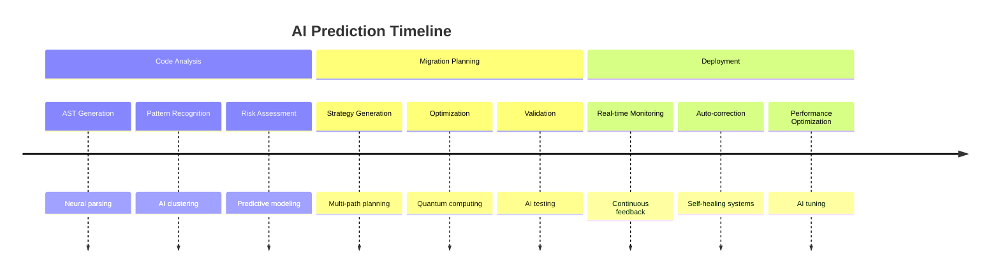

---

## 🔮 Immersive Experience

### 🎨 Spatial UI/UX System
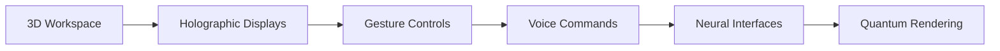

### 📊 Real-time Analytics Dashboard
```mermaid
dashboard
    title Real-time System Analytics
    section Migration Progress
        Current Phase : 75%
        Files Processed : 1,247 / 2,000
        Risk Level : Low
    section Performance Metrics
        CPU Usage : 45%
        Memory : 62%
        Network : 120 Mbps
    section AI Insights
        Optimization Opportunities : 23
        Security Recommendations : 7
        Performance Improvements : 15
```

---

## 📊 Live Demonstrations

### 🎥 Interactive Demos
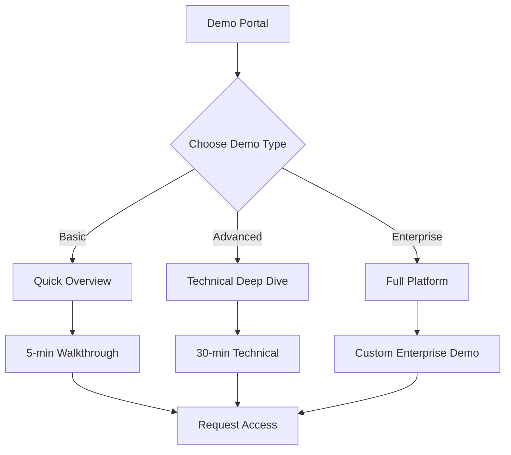

### 🔬 Live Code Examples
```typescript
// Quantum AI-Powered Migration Example
interface QuantumMigration {
  source: QuantumSystem;
  target: ModernStack;
  strategy: AIPlanning;
  safety: ZeroDowntime;
}

class Elderon2025 {
  async executeMigration(config: QuantumMigration): Promise<MigrationResult> {
    const analysis = await this.quantumAnalysis(config.source);
    const plan = await this.aiPlanning(analysis);
    const result = await this.executePlan(plan);
    
    return this.optimizeResult(result);
  }
  
  private async quantumAnalysis(system: QuantumSystem): Promise<Analysis> {
    // Quantum-powered code analysis
    return await QuantumNeuralNetwork.analyze(system);
  }
}
```

---

## 🏢 Enterprise Solutions

### 🔒 Quantum Security Framework
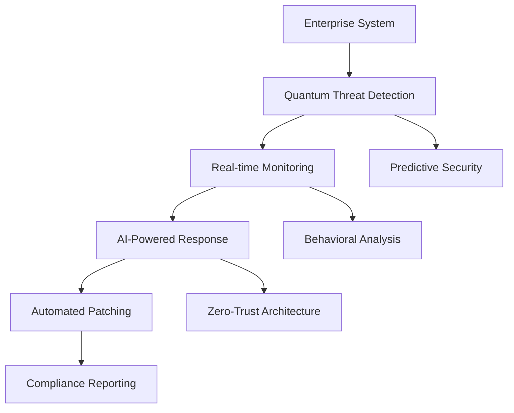

### 📈 Scalability Matrix
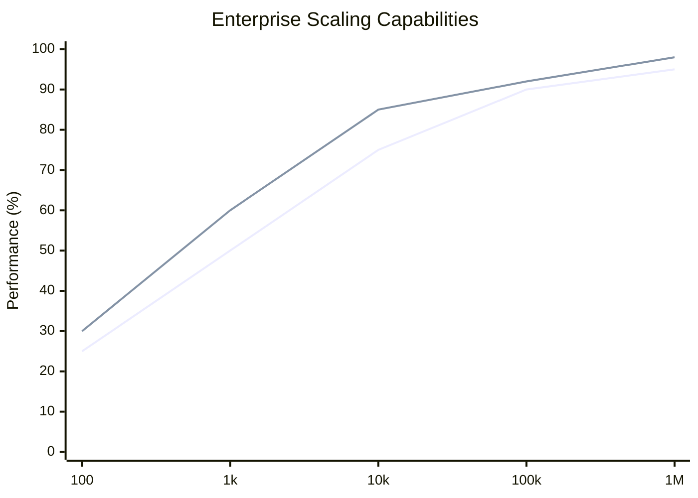

---

## 👨‍💻 Meet the Architect

### RedwoodsKenyan
**Quantum AI Architect & Enterprise Transformation Specialist**

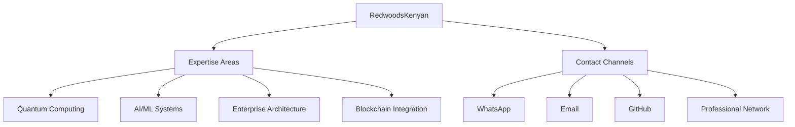

### 📞 Contact Matrix
<div align="center">

| Channel | Link | Response Time | Best For |
|---------|------|---------------|----------|
| **🚀 WhatsApp** | [Quick Chat](https://wa.me/254769148939?text=Hi%20RedwoodsKenyan%2C%20interested%20in%20Elderon%202025) | < 15 min | Urgent queries, demos |
| **📧 Email** | [redwoodkenya@gmail.com](mailto:redwoodkenya@gmail.com?subject=Elderon%202025%20Enterprise%20Inquiry) | < 2 hours | Detailed discussions |
| **💼 LinkedIn** | [Professional Profile](https://linkedin.com/in/redwoodskenyan) | < 6 hours | Enterprise partnerships |
| **🐙 GitHub** | [Project Issues](https://github.com/KenyanRedwoods01/Elderon/issues) | < 24 hours | Technical discussions |

</div>

---

## 📞 Quantum Support

### 🛡️ Support Tiers 2025
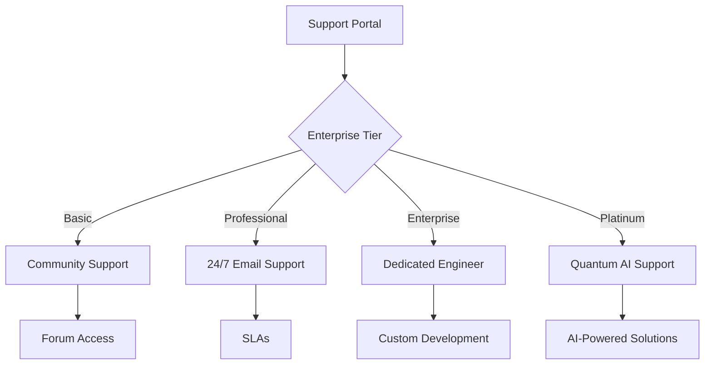

### 🔄 Response Flow
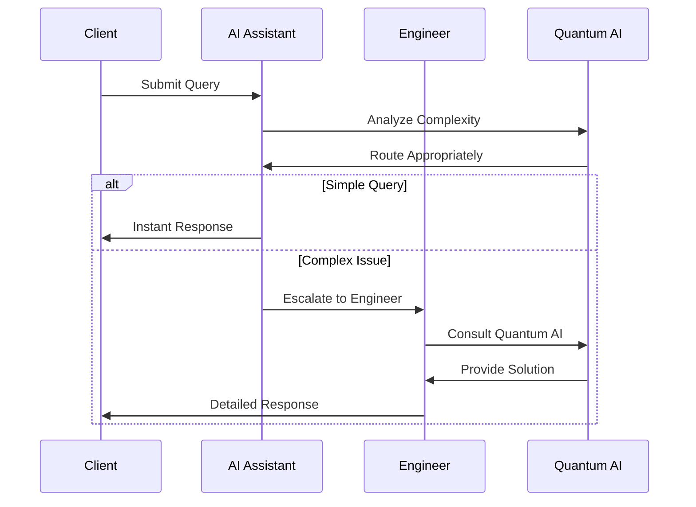

---

## 🚀 Get Started Today

### 🎯 Installation Options
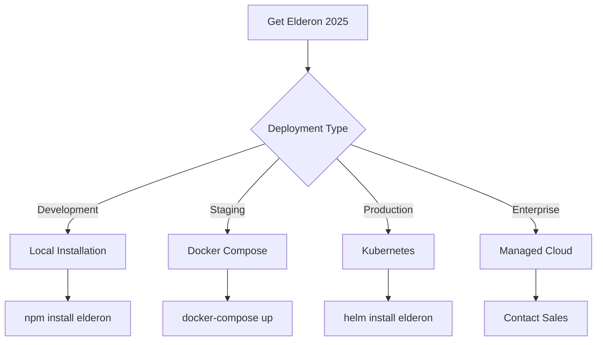

### 💰 Pricing Tiers
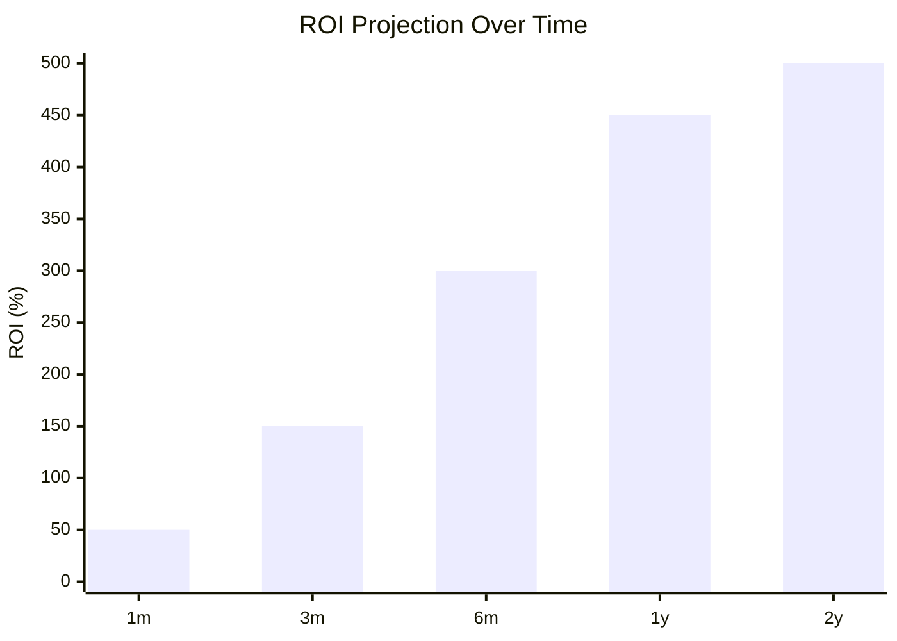

---

<div align="center">

## 🔮 Join the Quantum Revolution

[](https://elderon.ai/deploy)
[](https://wa.me/254769148939?text=Schedule%20Elderon%202025%20Demo)
[](docs/)
[](https://github.com/KenyanRedwoods01/Elderon/discussions)

---

## 📊 Real-time Repository Analytics

<div align="center">


</div>

---

### 🌟 **Architected by RedwoodsKenyan**

**Pioneering the Future of Enterprise Transformation**  
*Where Legacy Meets Quantum Innovation*

[](https://star-history.com/#KenyanRedwoods01/Elderon&Date)

</div>

---

## 📄 License & Compliance

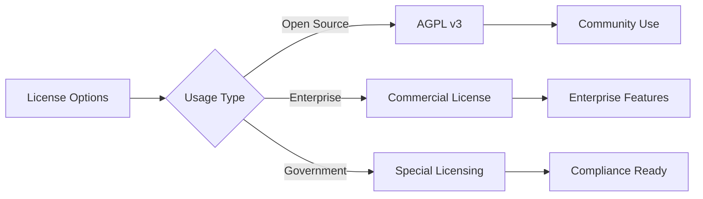

---

*© 2025 Elderon Quantum AI Platform. Developed by RedwoodsKenyan.*  
*Quantum Enterprise Transformation Through AI Innovation*

<div align="center">

**🚀 Ready for the Quantum Future?**  
*Transform your enterprise today with Elderon 2025*

[](https://wa.me/254769148939?text=Hi%20RedwoodsKenyan%2C%20I%27m%20interested%20in%20Elderon%202025%20for%20our%20enterprise%20transformation)
[](mailto:redwoodkenya@gmail.com?subject=Elderon%202025%20Architectural%20Consultation)

</div>
