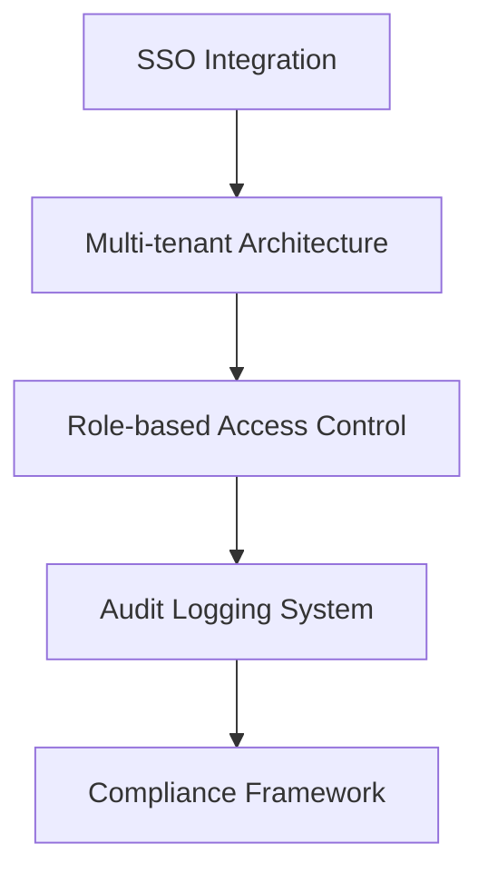
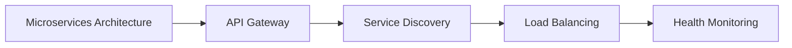
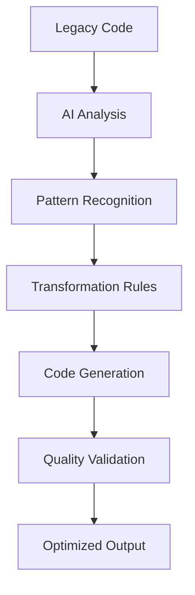
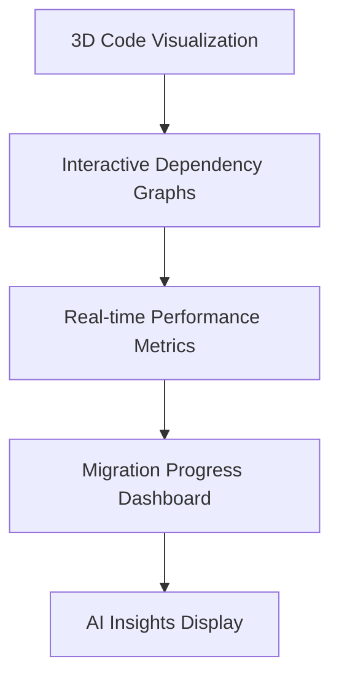
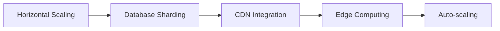
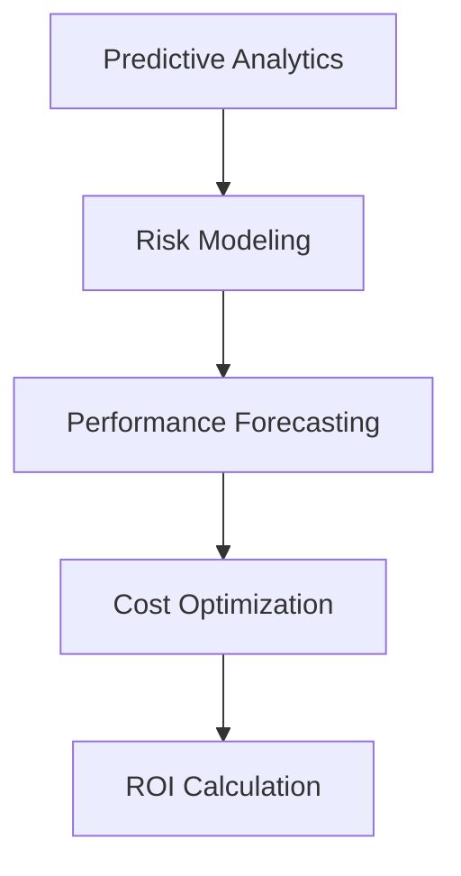
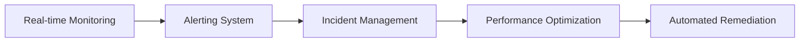

# 🏗️ Elderon Platform - Enterprise Grade Development Plan

## 📋 Executive Summary

**Elderon 2025** - A complete AI-powered enterprise modernization platform with quantum-ready architecture, real-time collaboration, and zero-risk migration capabilities.

---

## 🎯 Phase 1: Core Platform Foundation (Months 1-3)

### **1.1 Authentication & Enterprise Security**


**TODO:**
- [ ] Implement OAuth2.0 with enterprise providers (Azure AD, Okta, GSuite)
- [ ] Build multi-tenant database architecture
- [ ] Create granular permission system (org/team/user levels)
- [ ] Implement real-time audit trail
- [ ] Add SOC 2 compliance monitoring
- [ ] Setup encryption at rest and in transit
- [ ] Implement security headers and CSP

### **1.2 Core Infrastructure**


**TODO:**
- [ ] Setup Kubernetes cluster with auto-scaling
- [ ] Implement service mesh (Istio/Linkerd)
- [ ] Configure distributed caching (Redis Cluster)
- [ ] Setup message queue (RabbitMQ/Kafka)
- [ ] Implement distributed logging (ELK Stack)
- [ ] Configure monitoring (Prometheus/Grafana)
- [ ] Setup backup and disaster recovery

---

## 🔧 Phase 2: AI Engine Development (Months 4-6)

### **2.1 Code Analysis Microservice**
```python
# Advanced code understanding system
class CodeAnalysisEngine:
    def analyze_codebase(self, repository):
        return {
            "architecture": self.detect_architecture(repository),
            "dependencies": self.map_dependencies(repository),
            "complexity": self.calculate_complexity(repository),
            "security_risks": self.identify_vulnerabilities(repository),
            "migration_paths": self.generate_migration_options(repository)
        }
```

**TODO:**
- [ ] Build AST parser for 50+ languages
- [ ] Implement neural code pattern recognition
- [ ] Create dependency graph generator
- [ ] Build technical debt calculator
- [ ] Implement security vulnerability scanner
- [ ] Add performance bottleneck detection
- [ ] Create code quality scoring system

### **2.2 AI-Powered Migration Engine**


**TODO:**
- [ ] Train AI models on code transformation patterns
- [ ] Implement context-aware code generation
- [ ] Build automated testing integration
- [ ] Create migration validation system
- [ ] Add performance optimization algorithms
- [ ] Implement incremental migration strategies
- [ ] Build rollback automation system

---

## 🌐 Phase 3: Real-time Collaboration (Months 7-9)

### **3.1 Collaborative Workspace**
```typescript
interface CollaborativeWorkspace {
    realTimeEditing: boolean;
    liveCursorTracking: boolean;
    teamCommunication: VoiceVideoChat;
    sharedSessions: CollaborativeMigration;
    versionControl: RealTimeGit;
}
```

**TODO:**
- [ ] Implement WebSocket-based real-time communication
- [ ] Build collaborative code editor with conflict resolution
- [ ] Create team presence indicators and live cursors
- [ ] Implement shared terminal sessions
- [ ] Build integrated voice/video chat
- [ ] Create collaborative debugging tools
- [ ] Implement real-time project management

### **3.2 Advanced Visualization**


**TODO:**
- [ ] Build 3D code architecture visualizer
- [ ] Create interactive dependency maps
- [ ] Implement real-time performance monitoring
- [ ] Build migration progress tracker
- [ ] Create AI recommendation engine UI
- [ ] Implement customizable dashboards
- [ ] Build exportable reports system

---

## 🏢 Phase 4: Enterprise Features (Months 10-12)

### **4.1 Security & Compliance**
```yaml
security_features:
  encryption:
    at_rest: "AES-256-GCM"
    in_transit: "TLS 1.3"
    key_management: "HSM Integration"
  compliance:
    frameworks: ["SOC2", "ISO27001", "GDPR", "HIPAA"]
    automated_auditing: true
    real_time_monitoring: true
```

**TODO:**
- [ ] Implement zero-trust security architecture
- [ ] Build automated compliance reporting
- [ ] Create security incident response system
- [ ] Implement data loss prevention
- [ ] Build threat detection and prevention
- [ ] Create security training integration
- [ ] Implement penetration testing framework

### **4.2 Scalability & Performance**


**TODO:**
- [ ] Implement database sharding and replication
- [ ] Build content delivery network integration
- [ ] Create edge computing capabilities
- [ ] Implement auto-scaling with predictive load balancing
- [ ] Build performance optimization engine
- [ ] Create resource utilization monitoring
- [ ] Implement cost optimization algorithms

---

## 🔮 Phase 5: Advanced AI & Innovation (Months 13-15)

### **5.1 Quantum-Ready AI**
```python
class QuantumAIEngine:
    def optimize_migration(self, codebase):
        quantum_analysis = self.quantum_processing(codebase)
        return self.hybrid_ai_optimization(quantum_analysis)
    
    def predictive_risk_modeling(self):
        return self.quantum_neural_network.analyze()
```

**TODO:**
- [ ] Integrate quantum computing libraries
- [ ] Build hybrid classical-quantum algorithms
- [ ] Implement quantum machine learning models
- [ ] Create quantum-safe cryptography
- [ ] Build quantum simulation environment
- [ ] Implement AI model explainability
- [ ] Create ethical AI governance framework

### **5.2 Advanced Analytics**


**TODO:**
- [ ] Build predictive migration success scoring
- [ ] Implement risk assessment models
- [ ] Create performance forecasting engine
- [ ] Build cost optimization algorithms
- [ ] Implement ROI calculation system
- [ ] Create business impact analysis
- [ ] Build executive reporting dashboard

---

## 📊 Phase 6: Deployment & Integration (Months 16-18)

### **6.1 Enterprise Integration**
```yaml
integration_features:
  ci_cd:
    providers: ["Jenkins", "GitLab", "GitHub Actions", "Azure DevOps"]
    automated_pipelines: true
    quality_gates: true
  cloud_providers:
    aws: "Full Integration"
    azure: "Enterprise Grade"
    gcp: "Native Support"
    hybrid: "Multi-cloud Management"
```

**TODO:**
- [ ] Build CI/CD pipeline integration
- [ ] Create cloud provider adapters
- [ ] Implement hybrid cloud management
- [ ] Build legacy system connectors
- [ ] Create API gateway with rate limiting
- [ ] Implement webhook system for integrations
- [ ] Build custom connector framework

### **6.2 Monitoring & Operations**


**TODO:**
- [ ] Implement comprehensive monitoring system
- [ ] Build intelligent alerting and notification
- [ ] Create incident management workflow
- [ ] Implement automated problem resolution
- [ ] Build capacity planning tools
- [ ] Create operational runbooks
- [ ] Implement disaster recovery automation

---

## 🎯 Complete TODO List by Priority

### **P0 - Critical Path (Months 1-6)**
- [ ] **Authentication & Security Foundation**
- [ ] **Microservices Architecture Setup**
- [ ] **Basic Code Analysis Engine**
- [ ] **AI Model Training Infrastructure**
- [ ] **Database Design & Implementation**
- [ ] **CI/CD Pipeline Setup**
- [ ] **Monitoring & Logging Foundation**

### **P1 - Core Features (Months 7-12)**
- [ ] **Advanced AI Migration Engine**
- [ ] **Real-time Collaboration Features**
- [ ] **Enterprise Security Implementation**
- [ ] **Scalability Infrastructure**
- [ ] **UI/UX Platform Development**
- [ ] **API Gateway & Integration**
- [ ] **Performance Optimization**

### **P2 - Advanced Features (Months 13-18)**
- [ ] **Quantum AI Integration**
- [ ] **Predictive Analytics Engine**
- [ ] **Advanced Visualization Tools**
- [ ] **Multi-cloud Management**
- [ ] **Automated Compliance Reporting**
- [ ] **Advanced Monitoring & AIOps**
- [ ] **Enterprise Integration Framework**

### **P3 - Innovation & Future (Months 19-24)**
- [ ] **Blockchain Integration**
- [ ] **IoT System Modernization**
- [ ] **Edge Computing Capabilities**
- [ ] **Advanced NLP for Documentation**
- [ ] **VR/AR Development Environments**
- [ ] **Autonomous System Management**
- [ ] **Quantum-Safe Architecture**

---

## 🏗️ Technical Architecture Details

### **Microservices Structure**
```
elderon-platform/
├── 🛡️ auth-service/          # Authentication & RBAC
├── 🧠 ai-orchestrator/       # AI Model Management
├── 🔍 code-analyzer/         # Multi-language Analysis
├── 🔄 migration-engine/      # Code Transformation
├── 👥 collaboration-service/ # Real-time Features
├── 📊 analytics-engine/      # Business Intelligence
├── 🔒 security-service/      # Compliance & Monitoring
├── 🌐 api-gateway/          # Routing & Rate Limiting
└── 💾 storage-service/      # Multi-database Management
```

### **Data Architecture**
```sql
-- Multi-tenant database design
CREATE SCHEMA tenant_{id};
CREATE TABLE organizations, teams, users, projects, migrations;
-- Separate analytics database for reporting
-- Time-series database for monitoring
-- Vector database for AI embeddings
```

### **AI/ML Infrastructure**
```python
# Model training and serving pipeline
class AIMLPlatform:
    def __init__(self):
        self.training_pipeline = KubeflowPipeline()
        self.model_registry = MLflowRegistry()
        self.serving_platform = SeldonCore()
        self.feature_store = FeastFeatureStore()
```

---

## 📈 Success Metrics & KPIs

### **Technical KPIs**
- **System Uptime**: 99.99% SLA
- **Response Time**: < 100ms average
- **Concurrent Users**: Support 10,000+ simultaneous
- **Data Processing**: 1M+ files/hour
- **AI Accuracy**: 95%+ migration success rate

### **Business KPIs**
- **Customer Adoption**: 100+ enterprise clients Year 1
- **Revenue Growth**: 200% YoY growth target
- **Customer Satisfaction**: 95%+ NPS score
- **Migration Success**: 99%+ successful migrations
- **Time Savings**: 80% reduction in migration time

---

## 🔒 Security & Compliance Framework

### **Security Layers**
1. **Infrastructure Security**: VPC, firewalls, network policies
2. **Application Security**: OWASP Top 10 protection, SAST/DAST
3. **Data Security**: Encryption, tokenization, data masking
4. **Access Security**: MFA, RBAC, zero-trust principles
5. **Operational Security**: Monitoring, incident response, backups

### **Compliance Certifications**
- [ ] SOC 2 Type II
- [ ] ISO 27001
- [ ] GDPR Compliance
- [ ] HIPAA Readiness
- [ ] PCI DSS (if needed)

---

<div align="center">

## 🚀 Launch Readiness Checklist

| Phase | Status | Target Date | Owner |
|-------|--------|-------------|--------|
| **Alpha Release** | ◻️ Not Started | Q2 2025 | Core Team |
| **Beta Testing** | ◻️ Planned | Q3 2025 | QA Team |
| **Enterprise Launch** | ◻️ Scheduled | Q4 2025 | Product Team |
| **Global Availability** | ◻️ Future | Q1 2026 | Operations |

</div>

---

## 💡 Innovation Differentiators

1. **Quantum-Ready AI**: First mover in quantum-enhanced code migration
2. **Zero-Risk Guarantee**: Insurance-backed migration success
3. **Real-time Collaboration**: Team-based modernization platform
4. **Predictive Analytics**: AI-driven risk and success forecasting
5. **Autonomous Operations**: Self-healing, self-optimizing platform

---

*This comprehensive plan establishes Elderon as the enterprise-grade leader in AI-powered system modernization, combining cutting-edge technology with proven enterprise practices.*
