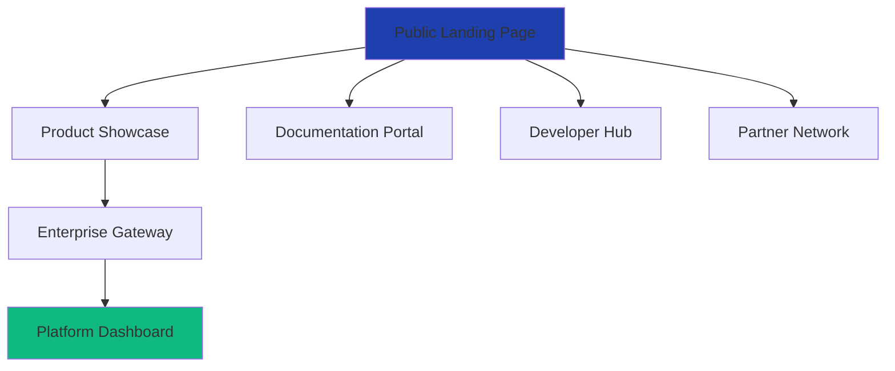

# 🏢 Elderon Platform - Enterprise Grade S-Level UI Architecture

## 🌐 **Yes - Multi-Tier Landing Experience**

### **Enterprise Landing Page Structure**


---

## 🎯 **Tier 1: Public Marketing Landing Page**

### **URL:** `elderon-platform.com`
```
apps/landing/
├── 📄 next.config.js
├── 📁 src/
│   ├── 📄 app/
│   │   ├── 📄 layout.tsx
│   │   ├── 📄 page.tsx                    # Main landing page
│   │   ├── 📁 features/                    # Feature showcase
│   │   ├── 📁 pricing/                     # Enterprise pricing
│   │   ├── 📁 case-studies/                # Success stories
│   │   └── 📁 contact/                     # Sales contact
│   ├── 📁 components/
│   │   ├── 📁 marketing/                   # Marketing components
│   │   │   ├── 📄 hero-section.tsx         # Hero with value proposition
│   │   │   ├── 📄 feature-grid.tsx         # Feature showcase
│   │   │   ├── 📄 testimonial-carousel.tsx # Customer testimonials
│   │   │   ├── 📄 pricing-table.tsx        # Enterprise pricing
│   │   │   ├── 📄 cta-section.tsx          # Call-to-action
│   │   │   └── 📄 demo-request.tsx         # Demo request form
│   │   └── 📁 layout/
│   │       ├── 📄 marketing-header.tsx
│   │       └── 📄 marketing-footer.tsx
│   └── 📁 lib/
│       ├── 📄 analytics.ts                 # Marketing analytics
│       └── 📄 lead-capture.ts              # Lead generation
└── 📁 public/
    ├── 📁 images/marketing/                # Marketing assets
    └── 📁 videos/demo/                     # Product demos
```

### **Key Sections:**
1. **Hero Section** - "Transform Legacy Systems with AI Precision"
2. **Enterprise Trust** - Fortune 500 logos + security badges
3. **Feature Showcase** - Interactive demos of key capabilities
4. **Case Studies** - Real enterprise transformation stories
5. **Pricing Tiers** - Transparent enterprise pricing
6. **Request Demo** - Enterprise sales contact form

---

## 🔐 **Tier 2: Platform Gateway & Authentication**

### **URL:** `platform.elderon-platform.com`
```
apps/gateway/
├── 📁 src/
│   ├── 📄 app/
│   │   ├── 📄 layout.tsx
│   │   ├── 📄 page.tsx                    # Gateway landing
│   │   ├── 📁 auth/                       # Authentication flows
│   │   │   ├── 📁 login/                  # Multi-provider login
│   │   │   ├── 📁 register/               # Enterprise registration
│   │   │   ├── 📁 sso/                    # Single Sign-On
│   │   │   └── 📁 onboarding/             # New organization setup
│   │   └── 📁 org-selection/              # Multi-tenant organization picker
│   ├── 📁 components/
│   │   ├── 📁 auth/
│   │   │   ├── 📄 enterprise-login.tsx    # Enterprise SSO buttons
│   │   │   ├── 📄 mfa-setup.tsx           # Multi-factor authentication
│   │   │   └── 📄 security-notice.tsx     # Security compliance info
│   │   └── 📁 gateway/
│   │       ├── 📄 org-switcher.tsx        # Organization selection
│   │       ├── 📄 security-badge.tsx      # Compliance badges
│   │       └── 📄 status-indicator.tsx    # System status
│   └── 📁 lib/
│       ├── 📄 auth-providers.ts           # OAuth2/OIDC configurations
│       └── 📄 security.ts                 # Security compliance checks
```

### **Authentication Features:**
- **Enterprise SSO** (SAML, OIDC, Azure AD, Okta)
- **Multi-factor Authentication** (TOTP, WebAuthn, SMS)
- **Organization Selection** - Multi-tenant access
- **Security Compliance** - SOC2, GDPR, HIPAA badges
- **System Status** - Real-time platform health

---

## 🏢 **Tier 3: Main Platform Dashboard**

### **URL:** `app.elderon-platform.com/dashboard`
```
apps/web/src/app/(dashboard)/
├── 📄 layout.tsx                          # Dashboard layout
├── 📄 page.tsx                           # Dashboard home
├── 📁 projects/                          # Project management
│   ├── 📄 page.tsx                       # Projects overview
│   ├── 📁 [id]/                          # Individual project
│   │   ├── 📄 page.tsx                   # Project dashboard
│   │   ├── 📁 analysis/                  # Code analysis
│   │   ├── 📁 migrations/                # Migration management
│   │   └── 📁 settings/                  # Project settings
│   └── 📁 new/                           # Project creation
├── 📁 analysis/                          # Code analysis workspace
│   ├── 📄 page.tsx                       # Analysis dashboard
│   ├── 📁 [projectId]/                   # Project-specific analysis
│   └── 📁 tools/                         # Analysis tools
├── 📁 migrations/                        # Migration management
│   ├── 📄 page.tsx                       # Migrations overview
│   ├── 📁 [migrationId]/                 # Individual migration
│   └── 📁 planning/                      # Migration planning
├── 📁 settings/                          # Organization settings
│   ├── 📄 page.tsx                       # Settings dashboard
│   ├── 📁 security/                      # Security settings
│   ├── 📁 billing/                       # Billing management
│   └── 📁 team/                          # Team management
└── 📁 api/                               # Dashboard API routes
```

### **Dashboard Components:**
```typescript
// Enterprise Dashboard Structure
interface EnterpriseDashboard {
  overview: {
    healthMetrics: RealTimeMetrics;
    activeProjects: ProjectSummary[];
    teamActivity: ActivityFeed;
    systemStatus: PlatformHealth;
  };
  navigation: {
    globalSearch: EnterpriseSearch;
    quickActions: ActionShortcuts;
    recentItems: QuickAccess;
  };
  workspace: {
    projectManager: ProjectManagement;
    analysisTools: CodeAnalysisWorkspace;
    migrationConsole: MigrationInterface;
    collaboration: TeamWorkspace;
  };
}
```

---

## 📊 **Advanced UI Features - S-Level Enterprise**

### **1. Real-Time Enterprise Dashboard**
```typescript
// apps/web/src/components/dashboard/enterprise-overview.tsx
export function EnterpriseOverview() {
  return (
    <div className="grid grid-cols-1 lg:grid-cols-4 gap-6">
      {/* System Health Metrics */}
      <RealTimeHealthWidget />
      
      {/* Active Migrations */}
      <MigrationProgressGrid />
      
      {/* Team Activity */}
      <TeamActivityFeed />
      
      {/* AI Insights */}
      <AIPerformanceRecommendations />
      
      {/* Security Compliance */}
      <ComplianceStatusPanel />
      
      {/* Cost Optimization */}
      <CostManagementDashboard />
    </div>
  );
}
```

### **2. Multi-Tenant Organization Management**
```typescript
// apps/web/src/components/enterprise/org-manager.tsx
export function OrganizationManager() {
  return (
    <EnterpriseContext>
      <OrganizationSwitcher />
      <TeamManagement />
      <ResourceAllocation />
      <BillingPortal />
      <ComplianceCenter />
    </EnterpriseContext>
  );
}
```

### **3. Advanced Code Analysis Workspace**
```typescript
// apps/web/src/components/analysis/enterprise-workspace.tsx
export function EnterpriseAnalysisWorkspace() {
  return (
    <SplitPanelLayout>
      <FileExplorer enterpriseFeatures={true} />
      <CodeEditor advancedAnalysis={true} />
      <AnalysisResults realTime={true} />
      <AIAssistant contextAware={true} />
    </SplitPanelLayout>
  );
}
```

---

## 🎨 **Enterprise UI/UX Standards**

### **Design System Components**
```
packages/ui/src/components/enterprise/
├── 📄 data-grid.tsx                       # Enterprise data tables
├── 📄 advanced-filters.tsx                # Complex filtering
├── 📄 real-time-charts.tsx                # Live data visualization
├── 📄 collaboration-widgets.tsx           # Team collaboration tools
├── 📄 security-badges.tsx                 # Compliance indicators
├── 📄 performance-metrics.tsx             # Real-time metrics
├── 📄 audit-logs.tsx                      # Activity tracking
└── 📄 enterprise-forms.tsx                # Complex form handling
```

### **Enterprise Theme System**
```typescript
// packages/ui/src/theme/enterprise-theme.ts
export const enterpriseTheme = {
  colors: {
    primary: '#1E40AF',    // Enterprise blue
    secondary: '#0F172A',  // Professional dark
    success: '#059669',    // Growth green
    warning: '#D97706',    // Attention amber
    error: '#DC2626',      // Critical red
  },
  typography: {
    fontFamily: {
      heading: 'Inter, system-ui, sans-serif',
      body: 'Inter, system-ui, sans-serif',
      mono: 'JetBrains Mono, monospace'
    }
  },
  components: {
    // Enterprise-specific component styles
  }
};
```

---

## 🔧 **Enterprise-Grade UI Features**

### **1. Real-Time Collaboration**
```typescript
// apps/web/src/components/collaboration/enterprise-collab.tsx
export function EnterpriseCollaboration() {
  return (
    <CollaborationProvider>
      <LiveCursors />
      <SharedEditing />
      <TeamPresence />
      <CommentThreads />
      <VersionHistory />
    </CollaborationProvider>
  );
}
```

### **2. Advanced Security Features**
```typescript
// apps/web/src/components/security/enterprise-security.tsx
export function EnterpriseSecurity() {
  return (
    <SecurityContext>
      <SessionManagement />
      <AccessLogs />
      <SecurityAlerts />
      <ComplianceDashboard />
    </SecurityContext>
  );
}
```

### **3. Performance Monitoring**
```typescript
// apps/web/src/components/performance/enterprise-monitoring.tsx
export function EnterprisePerformance() {
  return (
    <PerformanceMonitor>
      <RealTimeMetrics />
      <PerformanceInsights />
      <ResourceUsage />
      <OptimizationSuggestions />
    </PerformanceMonitor>
  );
}
```

---

## 🌐 **Multi-Domain Architecture**

### **Domain Strategy:**
```
Public Marketing Site:    elderon-platform.com
Platform Gateway:         platform.elderon-platform.com  
Main Application:         app.elderon-platform.com
API Gateway:             api.elderon-platform.com
Documentation:           docs.elderon-platform.com
Status Page:             status.elderon-platform.com
```

### **DNS Configuration:**
```yaml
# Cloudflare Enterprise DNS
A records:
  - elderon-platform.com → Load Balancer
  - platform.elderon-platform.com → Auth Gateway
  - app.elderon-platform.com → Application Cluster
  - api.elderon-platform.com → API Gateway

CNAME records:
  - docs.elderon-platform.com → CDN
  - status.elderon-platform.com → Statuspage.io
```

---

## 🚀 **Enterprise UI Roadmap**

### **Phase 1: Foundation (Month 1-2)**
- [ ] Public marketing site
- [ ] Authentication gateway
- [ ] Basic dashboard layout
- [ ] Core navigation system

### **Phase 2: Core Platform (Month 3-4)**
- [ ] Project management interface
- [ ] Code analysis workspace
- [ ] Migration planning tools
- [ ] Team collaboration features

### **Phase 3: Enterprise Features (Month 5-6)**
- [ ] Advanced security controls
- [ ] Real-time analytics
- [ ] Multi-tenant management
- [ ] Compliance dashboards

### **Phase 4: S-Level Innovation (Month 7+)**
- [ ] AI-powered insights
- [ ] Predictive analytics
- [ ] Advanced visualization
- [ ] Customizable workspaces

---

## ✅ **Enterprise UI Readiness Checklist**

### **Before Starting Development:**
- [ ] Design system components built
- [ ] Enterprise theme system configured
- [ ] Authentication flows designed
- [ ] Dashboard layout approved
- [ ] Mobile responsiveness planned
- [ ] Accessibility compliance ensured
- [ ] Performance benchmarks set
- [ ] Security requirements defined

### **Quality Standards:**
- **Performance**: < 3s initial load, < 100ms interactions
- **Accessibility**: WCAG 2.1 AA compliance
- **Security**: OWASP Top 10 protection
- **Browser Support**: Chrome, Firefox, Safari, Edge (latest 2 versions)
- **Mobile**: Responsive down to 320px width

---

**🎯 STATUS: ENTERPRISE UI ARCHITECTURE READY**  
*S-Level user experience designed for Fortune 500 adoption*
